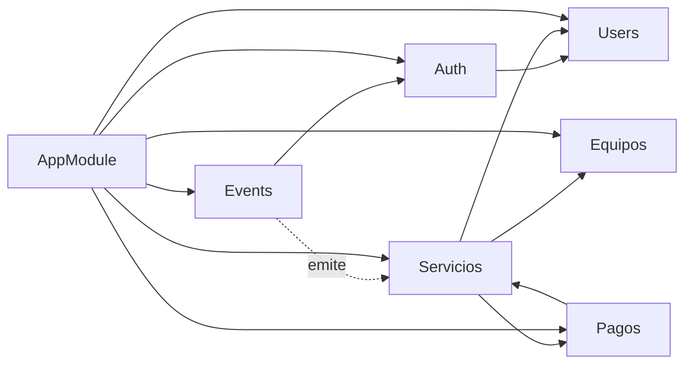
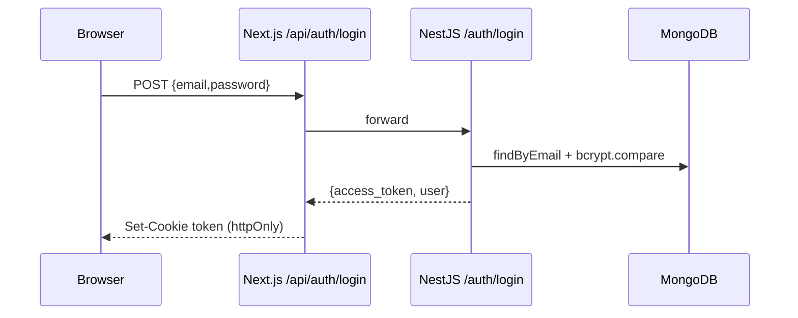
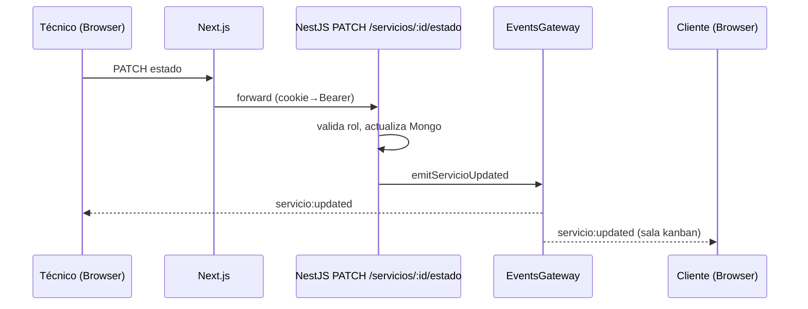

# ARCHITECTURE.md

> Documentación de arquitectura. Última actualización: 2026-07-19

## Arquitectura general

MG Support Tech sigue un patrón **BFF (Backend for Frontend)** sobre Next.js App Router, con un backend NestJS que expone API REST + WebSocket. El browser nunca habla directo con NestJS: pasa por las rutas `/api/*` de Next.js, que actúan como proxy y gestionan la cookie `token` (httpOnly).

```mermaid
flowchart TB
    Browser[Browser / Rol: admin|tecnico|cliente]
    Nginx[Nginx :80/:443]
    Next[Next.js Frontend :3000<br/>middleware.ts + /api proxy]
    Nest[NestJS Backend :4000<br/>/api REST + /kanban WS]
    Mongo[(MongoDB Atlas)]
    WS[socket.io /kanban]

    Browser -->|HTTPS| Nginx
    Nginx -->|/ y /api/auth| Next
    Nginx -->|/api y /socket.io| Nest
    Next -->|fetch interno| Nest
    Nest <-->|Mongoose| Mongo
    Browser -->|WS upgrade| Nginx --> WS
    Nest --> WS
```

## Capas

### 1. Capa de presentación (Frontend Next.js)
- `app/page.tsx`: redirección según rol.
- `app/{admin,tecnico,cliente,login}`: páginas por rol.
- `middleware.ts`: autenticación/autorización en el edge (verifica JWT con `jose`).
- `app/api/*/route.ts`: proxies que reenvían al backend y setean/borran la cookie.

### 2. Capa de aplicación (Backend NestJS)
- `auth`: login, `JwtStrategy`, `JwtAuthGuard`.
- `users`, `equipos`, `servicios`, `pagos`: dominios de negocio.
- `common`: `RolesGuard`, `@Roles()`, `@CurrentUser()`, `enums`.
- `events`: `EventsGateway` WebSocket.

### 3. Capa de datos
- Mongoose Schemas por dominio.
- MongoDB Atlas como única fuente en producción.

## Dependencias entre módulos



## Flujo de datos — Login



## Flujo de datos — Kanban en tiempo real



## Responsabilidades de cada módulo

| Módulo | Responsabilidad |
|--------|-----------------|
| `auth` | Emisión y validación de JWT, login. |
| `users` | CRUD de usuarios, sanitización, búsqueda por email/id. |
| `equipos` | Registro de equipos recibidos (alias `/platos`). |
| `servicios` | Ciclo de vida del servicio, código `MGS-XXXX`, Kanban, observaciones. |
| `pagos` | Registro de pagos (Nequi/B-Bre), validación de estado `Listo`. |
| `events` | Gateway WebSocket que emite actualizaciones de servicio. |
| `common` | RBAC (RolesGuard, @Roles), CurrentUser, enums compartidos. |
| `health` | Endpoint `/api/health` para docker healthcheck. |

## Consideraciones de seguridad por capa

- **Edge (middleware)**: verifica firma JWT con `jose`. Si `JWT_SECRET` falta, usa fallback inseguro.
- **Proxy**: no reenvía la cookie al cliente; la mantiene server-side.
- **Backend**: `ValidationPipe` estricto + guards. Falta helmet, throttler, secure cookies.
- **WebSocket**: autentica handshake con JWT, pero autorización por sala es amplia (`kanban` incluye clientes).
